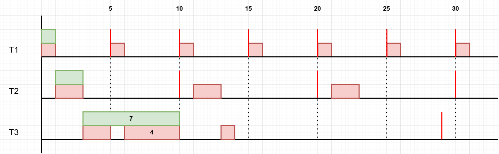
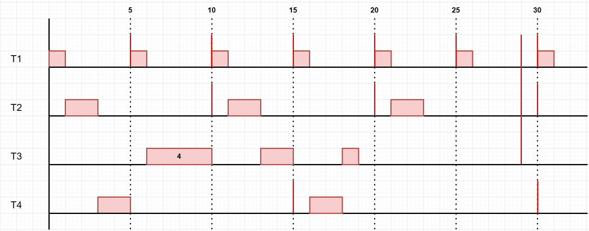
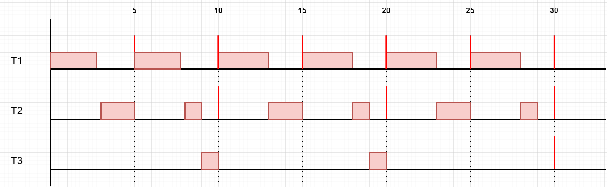

# TD1 d’ordonnancement temps réel

## Exercice 1 - Politique RMS

Soit les trois tâches indépendantes, prêtes à la date t=0 :

- T1 (C=1, D=P=5),
- T2 (C=2, D=P=10),
- T3 (C=7, D=P=29).

En considérant une politique d’ordonnancement RMS :

1. Rappeler la condition d’ordonnancement (préemptif) de cette politique.
2. Calculer le taux d'utilisation du processeur, que peut-on en conclure sur l’ordonnancabilité ?
3. Donner un schéma du séquencement des tâches sur 30 unités de temps dans le cas préemptif puis dans le cas non-préemptif. Quelle conclusion peut-on faire sur ce jeu de tâches ?
4. On considère une tâche supplémentaire T4(2,15). Refaire l’analyse précédente dans le cas préemptif uniquement.
5. On modifie maintenant le système en ne considérant que les tâches T1, T2 et T3 en modifiant T1(3, 5), T2(3,10) et T2(2,30). Le jeu de tâches est dit « harmonique » car les périodes sont multiples. Reprenez l’analyse en mode préemptif.
6. Que déduisez-vous de la condition d’ordonnancement RMS ?
7. Appliquer le théorème de la zone critique pour vérifier ce constat.

### Réponses exercice 1

| | C | P |
|---|---|---|
| T1 | 1 | 5 |
| T2 | 2 | 10 |
| T3 | 7 | 29 |
| T4 | 2 | 15 |

a.  
Plus petite est la période, plus grande est sa priorité  
$$U = \sum_{i=1}^{n} \frac{C_i}{T_i} \leq n(2^{\frac{1}{n}}-1)$$

b. n = nombre de tâches = 3

$$
\begin{align}
U &= \frac{1}{5} + \frac{2}{10} + \frac{7}{29} &\leq &3(2^{\frac{1}{3}}-1) \\
&= 0.2 + 0.2 + 0.24 &\leq &1.78 \\
&= 0.64 &\leq &1.78 \\
\end{align}
$$

c.
non préemptif : si on commence une tache on la finit sans interruption

d.

$$
\begin{align}
U &= \frac{1}{5} + \frac{2}{10} + \frac{7}{29} + \frac{2}{15} &\leq &4(2^{\frac{1}{4}}-1) \\
&= 0.2 + 0.2 + 0.24 + 0.13 &\leq &0.757 \\
&= 0.77 &\leq &0.757 \\
\end{align}
$$

e.

| | C | P |
|---|---|---|
| T1 | 3 | 5 |
| T2 | 3 | 10 |
| T3 | 2 | 30 |

$$
\begin{align}
U &= \frac{3}{5} + \frac{3}{10} + \frac{2}{30} &\leq &3(2^{\frac{1}{3}}-1) \\
&= 0.6 + 0.3 + 0.06 &\leq &0.78 \\
&= 0.96 &\leq &0.78 \\
\end{align}
$$
$\Rightarrow$ Faux

On peut tenter un ordonnancement sans garantie qu'il soit correct

f.

J'en déduis que la condition d'ordonnancement RMS est valide alors on peut tenter un ordonnancement avec garantie qu'il soit correct.

g.

$$
i = 1 \Rightarrow T_0 = C_1 = 3 \Rightarrow W_1(0) = 3; W_1(3) = 3 \times \left \lceil\frac{3}{5}\right \rceil = 3 \Rightarrow W_1(3) = 3
$$

$$
\begin{align}
i = 2 \Rightarrow T_0 = C_1 + C_2 = 6 \Rightarrow W_2(0) = 6; &W_2(6) = 3 \times \left \lceil\frac{6}{5} \right \rceil + 3 \times \left \lceil\frac{6}{10} \right \rceil = 9 \\ 
&W_2(9) = 3 \times \left \lceil\frac{9}{5} \right \rceil + 3 \times \left \lceil\frac{9}{10} \right \rceil = 9 \\
\Rightarrow &W_2(9) = 9
\end{align}
$$
