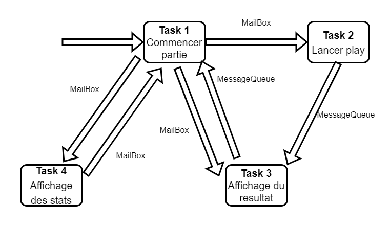

## 1. Création de tâches

### R1. Rappeler les paramètres des deux fonctions de création de tâches uCOS

| OSTaskCreate Paramètre | Type             |
|------------------------|------------------|
| task                   | void(*)(void*pd) |
| pdata                  | void*)           |
| ptos                   | OS__STK*         |
| prio                   | INT8U            |

| OSTaskCreateExt Paramètre | Type             |
|---------------------------|------------------|
| task                      | void(*)(void*pd) |
| pdata                     | void*            |
| ptos                      | OS__STK*         |
| prio                      | INT8U            |
| id                        | INT16U           |
| pbos                      | OS_STK*          |
| stk_size                  | INT32U           |
| pext                      | void*            |
| opt                       | INT16U           |

### R2. Citer les différents services disponibles dans uCOS

| Services                 | Communication ou Synchronisation ? |
|--------------------------|------------------------------------|
| Sémaphores               | Synchronisation                    |
| Signaux                  | Synchronisation                    |
| Mutexes                  | Synchronisation                    |
| Rendez-vous              | Synchronisation                    |
| Change de contexte       | Synchronisation                    |
| Event-Flags              | Synchronisation                    |
| Files d'attentes (Queue) | Communication                      |
| MailBox                  | Communication                      |
| Management de la mémoire | Communication                      |
| Portage uC/OS-II         | Communication                      |
| Ordonnancement           | Communication                      |

### R3. Que constatez vous ?

Quand $D1 >= D2$ il n'y a pas de problème, tous les messages sont bien reçus. En revanche quand $D2 > D1$ tous les
messages ne sont pas reçus, et au lieu de recevoir des messages $1$ par $1$, nous les recevons $k$ par $k$, avec $k > 0$
et $D2 = k * D1$.

### R4. Faite le schéma des communications entre tâches et ISR, en nommant les tâches selon leur priorité (T1, T2, T12…)

- **Task 1 :** Cette tâche est celle qui détermine si on veut commencer une partie, demander l'affichage du temps moyen
  ou afficher dans la console les différentes statistiques des différentes tâches.

- **Task 2 :** Cette tâche permet de lancer le jeu de réflexe puis envoie le résultat à la tâche 3.

- **Task 3 :** Cette tâche sert d'affichage sur les afficheurs 7 segments pour le temps de jeu ou le temps de jeu moyen.

- **Task 4 :** Cette tâche permet d'afficher dans la console les différentes statistiques des différentes tâches.

### R5. Noter les informations mesurées

| Tâche  | Nombre d'exécutions | Temps d’exécution moyen | Pile libre | Pile utilisée |
|--------|---------------------|-------------------------|------------|---------------|
| Task 1 | 5                   | 49,5 ms                 | 6824       | 1368          |
| Task 2 | 5                   | 58,5 ms                 | 5264       | 2928          |
| Task 3 | 5                   | 1 ms                    | 6956       | 1236          |
