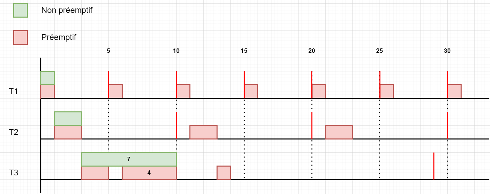
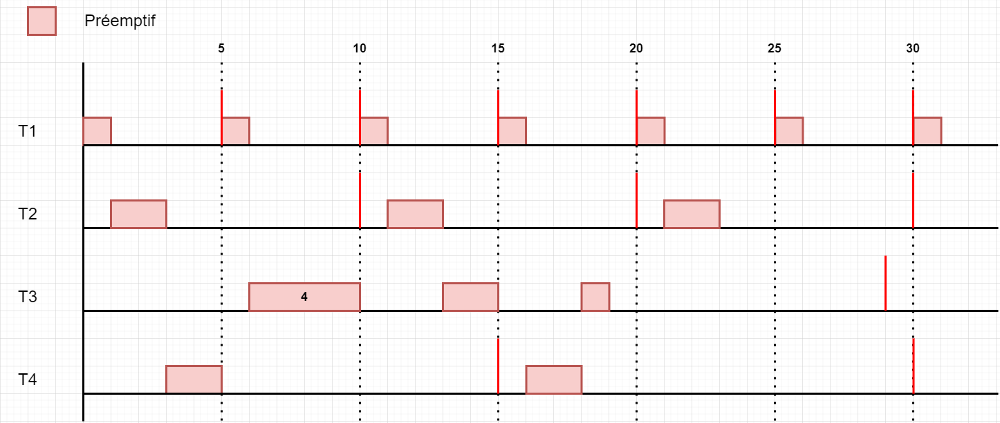
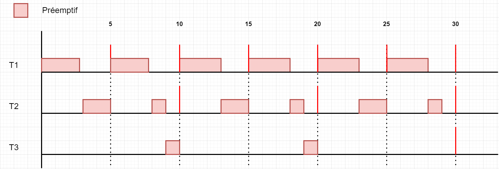
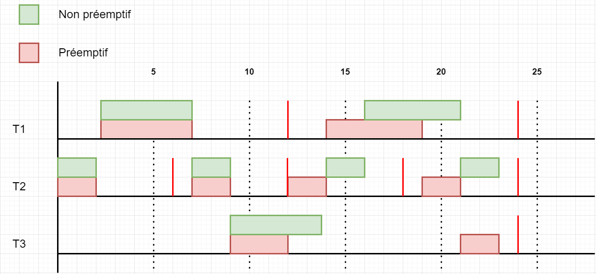
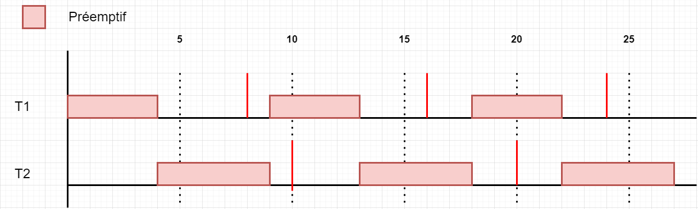
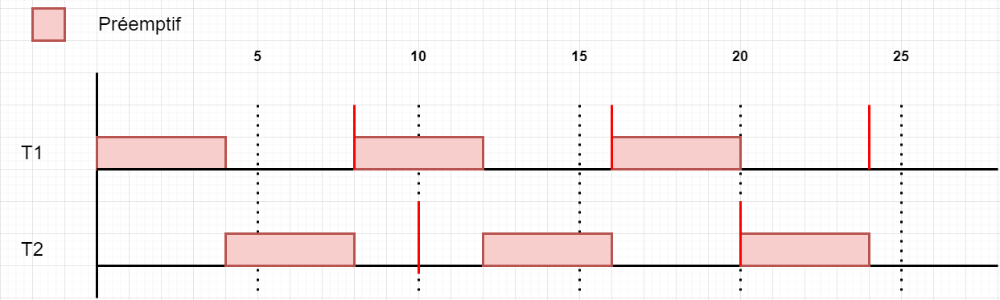
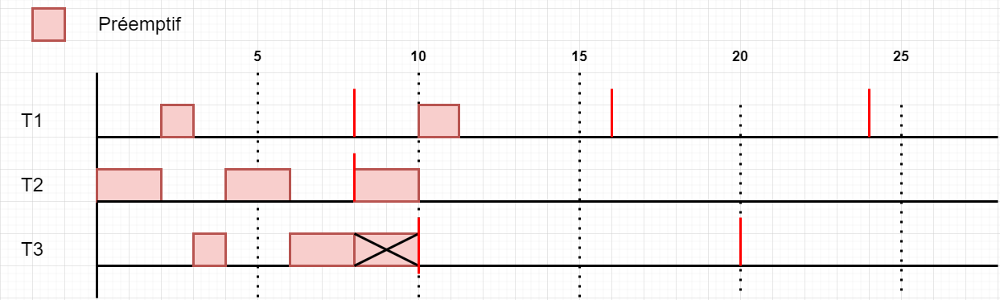
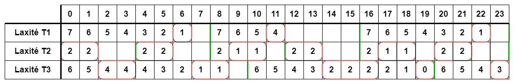
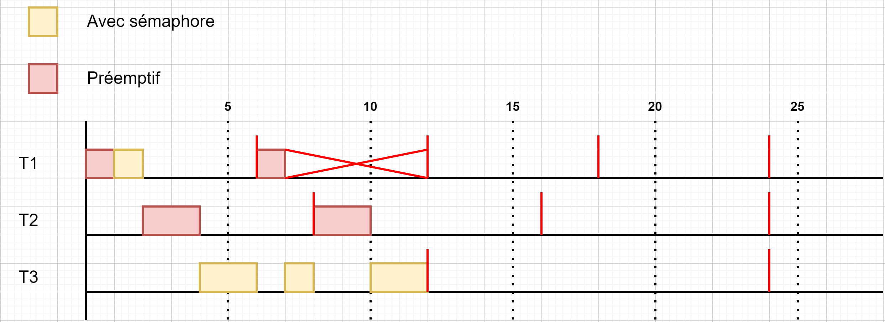
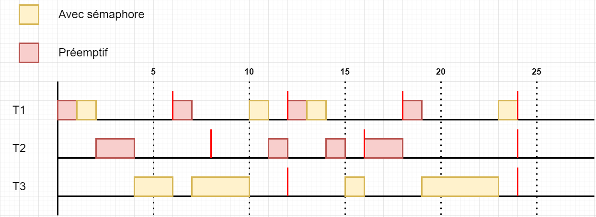

# TD1 d’ordonnancement temps réel

- [TD1 d’ordonnancement temps réel](#td1-dordonnancement-temps-réel)
  - [Exercice 1 - Politique RMS](#exercice-1---politique-rms)
    - [Réponses exercice 1](#réponses-exercice-1)
  - [Exercice 2 – Politique EDF](#exercice-2--politique-edf)
    - [Réponse exercice 2](#réponse-exercice-2)
- [TD2 d’ordonnancement temps réel](#td2-dordonnancement-temps-réel)
  - [Exercice 3 - Comparaison d'ordonnancements](#exercice-3---comparaison-dordonnancements)
    - [Réponse exercice 3](#réponse-exercice-3)
      - [EDF](#edf)
      - [RMS](#rms)
  - [Exercice 4 - Politique LLF](#exercice-4---politique-llf)
    - [Réponse exercice 4](#réponse-exercice-4)
      - [Pour RMS](#pour-rms)
      - [Pour LLF](#pour-llf)
  - [Exercice 5 - Partage de ressources](#exercice-5---partage-de-ressources)
    - [Réponse exercice 5](#réponse-exercice-5)
      - [Sans inversion de priorité](#sans-inversion-de-priorité)
      - [Avec inversion de priorité](#avec-inversion-de-priorité)

## Exercice 1 - Politique RMS

Soit les trois tâches indépendantes, prêtes à la date t=0 :

- T1 (C=1, D=P=5),
- T2 (C=2, D=P=10),
- T3 (C=7, D=P=29).

En considérant une politique d’ordonnancement RMS :

- a. Rappeler la condition d’ordonnancement (préemptif) de cette politique.
- b. Calculer le taux d'utilisation du processeur, que peut-on en conclure sur l’ordonnancabilité ?
- c. Donner un schéma du séquencement des tâches sur 30 unités de temps dans le cas préemptif puis dans le cas non-préemptif. Quelle conclusion peut-on faire sur ce jeu de tâches ?
- d. On considère une tâche supplémentaire T4(2,15). Refaire l’analyse précédente dans le cas préemptif uniquement.
- e. On modifie maintenant le système en ne considérant que les tâches T1, T2 et T3 en modifiant T1(3, 5), T2(3,10) et T2(2,30). Le jeu de tâches est dit « harmonique » car les périodes sont multiples. Reprenez l’analyse en mode préemptif.
- f. Que déduisez-vous de la condition d’ordonnancement RMS ?
- g. Appliquer le théorème de la zone critique pour vérifier ce constat.

### Réponses exercice 1

|    | C | P  |
|----|---|----|
| T1 | 1 | 5  |
| T2 | 2 | 10 |
| T3 | 7 | 29 |
| T4 | 2 | 15 |

a.  
Plus petite est la période, plus grande est sa priorité  
$$U = \sum_{i=1}^{n} \frac{C_i}{T_i} \leq n(2^{\frac{1}{n}}-1)$$

b. n = nombre de tâches = 3

$$
\begin{align}
U &= \frac{1}{5} + \frac{2}{10} + \frac{7}{29} &\leq &3(2^{\frac{1}{3}}-1) \\
&= 0.2 + 0.2 + 0.24 &\leq &1.78 \\
&= 0.64 &\leq &1.78 \\
\end{align}
$$

$\Rightarrow$ Vrai

c.
non préemptif : si on commence une tache on la finit sans interruption

On peut en conclure que le système est ordonnancable uniquement en mode préemptif, sinon la tache 1 ne peut pas faire sa seconde période.

d.

$$
\begin{align}
U &= \frac{1}{5} + \frac{2}{10} + \frac{7}{29} + \frac{2}{15} &\leq &4(2^{\frac{1}{4}}-1) \\
&= 0.2 + 0.2 + 0.24 + 0.13 &\leq &0.757 \\
&= 0.77 &\leq &0.757 \\
\end{align}
$$

$\Rightarrow$ Faux

Rouge = préemptif

e.

|    | C | P  |
|----|---|----|
| T1 | 3 | 5  |
| T2 | 3 | 10 |
| T3 | 2 | 30 |

$$
\begin{align}
U &= \frac{3}{5} + \frac{3}{10} + \frac{2}{30} &\leq &3(2^{\frac{1}{3}}-1) \\
&= 0.6 + 0.3 + 0.06 &\leq &0.78 \\
&= 0.96 &\leq &0.78 \\
\end{align}
$$

$\Rightarrow$ Faux

On peut tenter un ordonnancement sans garantie qu'il soit correct

f.

J'en déduis que la condition d'ordonnancement RMS est valide alors on peut tenter un ordonnancement avec garantie qu'il soit correct. Mais le fait que la condition ne soit pas vérifiée ne veut pas dire qu'il n'y a pas d'ordonnancement possible.

g.

Théorème de la zone critique

Formule : $W_j(n) = \sum_{i=1}^{j} C_i \times \left \lceil\frac{T}{T_i} \right \rceil$

$$
i = 1 \Rightarrow T_0 = C_1 = 3 \Rightarrow W_1(0) = 3; W_1(3) = 3 \times \left \lceil\frac{3}{5}\right \rceil = 3 \Rightarrow W_1(3) = 3
$$

$$
\begin{align}
i = 2 \Rightarrow T_0 = C_1 + C_2 = 6 \Rightarrow W_2(0) = 6; &W_2(6) = 3 \times \left \lceil\frac{6}{5} \right \rceil + 3 \times \left \lceil\frac{6}{10} \right \rceil = 9 \\
&W_2(9) = 3 \times \left \lceil\frac{9}{5} \right \rceil + 3 \times \left \lceil\frac{9}{10} \right \rceil = 9 \\
\Rightarrow &W_2(9) = 9
\end{align}
$$

$$
\begin{align}
i = 3 \Rightarrow T_0 = \sum_{i=1}^{3} C_i = 8 \Rightarrow W_3(0) = 8; &W_3(8) = 3 \times \left \lceil\frac{8}{5} \right \rceil + 3 \times \left \lceil\frac{8}{10} \right \rceil + 2 \times \left \lceil\frac{8}{30} \right \rceil = 11 \\
&W_3(11) = 3 \times \left \lceil\frac{11}{5} \right \rceil + 3 \times \left \lceil\frac{11}{10} \right \rceil + 2 \times \left \lceil\frac{11}{30} \right \rceil = 11 \\
&W_3(17) = 3 \times \left \lceil\frac{17}{5} \right \rceil + 3 \times \left \lceil\frac{17}{10} \right \rceil + 2 \times \left \lceil\frac{17}{30} \right \rceil = 20 \\
&W_3(20) = 3 \times \left \lceil\frac{20}{5} \right \rceil + 3 \times \left \lceil\frac{20}{10} \right \rceil + 2 \times \left \lceil\frac{20}{30} \right \rceil = 20 \\
\Rightarrow &W_3(20) = 20
\end{align}
$$

$\Rightarrow W_3(20) < T_3 = 30$ on peut en conclure que le théorème de la zone critique est vérifié. Donc l'ordonnancement est correct.

## Exercice 2 – Politique EDF

On considère à présent 3 tâches T1(5,12), T2(2,6) et T3(5,24).

Calculer le taux d'utilisation. Concluez sur l’ordonnancabilité.

Déterminer le nombre d’unités de temps libre sur la période totale d’ordonnancement.

Dessinez sur cette période d’étude le séquencement généré par EDF d’abord en mode préemptif puis en mode non-préemptif.

Quelle seraient les caractéristiques maximum (temps d’exécution et fréquence) d’une tâche apériodique à exécuter en plus de ces 3 tâches pour que le système reste ordonnancable ?

### Réponse exercice 2

|    | C | T  |
|----|---|----|
| T1 | 5 | 12 |
| T2 | 2 | 6  |
| T3 | 5 | 24 |

$$
\begin{align}
U &= \frac{5}{12} + \frac{2}{6} + \frac{5}{24} &\leq &1 \\
&= 0.42 + 0.33 + 0.21 &\leq &1 \\
&= 0.96 &\leq &1 \\
\end{align}
$$

**hyper période :** la plus grande période des tâches périodiques

Il y a 1 unité de temps libre sur la période totale d'ordonnancement car nous avons une hyper période de 24.

# TD2 d’ordonnancement temps réel

## Exercice 3 - Comparaison d'ordonnancements

Soient deux tâches T1 et T2 définies par les paramètres suivants :  
S = 0, P1 = 8, P2 = 10, C1 = 4 et C2 = 5.

Les délais critiques sont égaux aux périodes (soient $\forall i : D_i = P_i$).

- Dessinez sur les 24 premières unités de temps l’ordonnancement généré par EDF (en mode  préemptif).  
  Existe il des échéances manquées ?
- Dessinez sur les 24 premières unités de temps l’ordonnancement généré par un algorithme à priorités fixes RM (en mode préemptif).  
  Existe il des échéances manquées ?
- Concluez

### Réponse exercice 3

|    | C | P  |
|----|---|----|
| T1 | 4 | 8  |
| T2 | 5 | 10 |

#### EDF

$$
\begin{align}
U &= \frac{4}{8} + \frac{5}{10} &\leq &1 \\
&= 0.5 + 0.5 &\leq &1 \\
&= 1 &\leq &1 \\
\end{align}
$$

$\Rightarrow$ Vrai

#### RMS

$$
\begin{align}
U &= \sum_{i=1}^{n} \frac{C_i}{T_i} &\leq n(2^{\frac{1}{n}} - 1) \\
&= \frac{4}{8} + \frac{5}{10} &\leq 2(2^{\frac{1}{2}} - 1) \\
&= 0.5 + 0.5 &\leq 0.828 \\
&= 1 &\leq 0.828 \\
\end{align}
$$

$\Rightarrow$ Faux

À l'unité de temps 10, la tâche devrait s'être exécuté pendant 5 unité de temps, hors elle n'en a fait que 4, nous avons donc des échéances manquées.

## Exercice 4 - Politique LLF

Soient trois tâches T1(1,8), T2(2,4) et T3(4,10).
Les délais critiques sont égaux aux périodes (soient $\forall i : D_i = P_i$).

- Dessinez sur les 24 premières unités de temps l’ordonnancement généré par RMS (en mode préemptif). Existe il des échéances manquées ?
- Dessinez sur les 24 premières unités de temps l’ordonnancement généré par un algorithme à LLF (en mode préemptif). Existe il des échéances manquées ?
- Concluez

### Réponse exercice 4

#### Pour RMS

À l'unité de temps 10, la tâche $T_3$ devrait s'être exécuté pendant 4 unité de temps, hors elle n'en a fait que 3, nous avons donc des échéances manquées.

#### Pour LLF

## Exercice 5 - Partage de ressources

Dans cet exercice, on souhaite montrer l’impact d’une inversion de priorité sur l’ordonnancement d’un jeu de tâches.

Soient trois tâches définies par les paramètres suivants :  
S1 = S2 = S3 = 0, P1 = 6, C1 = 2, P2 = 8,C2 = 2, P3 = 12 et C3 = 5.

Les délais critiques sont égaux aux périodes (soient $D_i = P_i$).

On utilise un algorithme à priorité fixe RM pour ordonnancer les tâches (mode préemptif).

Les tâches T1 et T3 se partagent une ressource qu’elles accèdent en exclusion mutuelle. T1 accède à la ressource durant la deuxième unité de temps de sa capacité. T3 accède à la ressource durant la totalité de sa capacité.

- Dessinez sur la période d’étude l’ordonnancement généré par un algorithme à priorité fixe RM. Vous indiquerez les moments d’accès exclusif à la ressource ainsi que le moment où l’inversion de priorité intervient
- On suppose que l’on utilise la méthode d’héritage simple : une tâche qui bloque une autre plus prioritaire qu’elle, exécute la section critique avec la priorité de la tâche bloquée. Cette méthode d’héritage s’appele aussi PIP pour Priority Inheritance Protocol. Redessinez l’ordonnancement sur la période d’étude et indiquez le moment sur le graphe où l’inversion de priorité est évitée.

### Réponse exercice 5

|    | C | P  |
|----|---|----|
| T1 | 2 | 6  |
| T2 | 2 | 8  |
| T3 | 5 | 12 |

#### Sans inversion de priorité

#### Avec inversion de priorité

