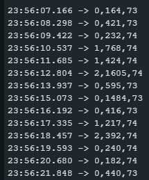

---
output:
  pdf_document: default
  html_document: default
---
# Projet

* Vinh Faucher
* Florian Latapie

## Description du projet

### Contexte

Nous avons décidé d’essayer de reconnaître les cris de différents oiseaux. Nous nous appuyons pour cela sur la base de données de [Xeno-canto](https://xeno-canto.org/) donnée en cours qui contient une immense variété d’enregistrements d’oiseaux différents.

Afin de déterminer quelles espèces utiliser lors de notre apprentissage et de nos tests, nous avons décidé de chercher les datasets possédant le plus d’enregistrements dans le but d’avoir une base de sons la plus variée possible. Pour cela, nous avons utilisé document Excel dans le but de pouvoir trier efficacement et facilement les données dans un tableau


Notre choix s’est ainsi porté sur les trois oiseaux possédant le plus grand nombre d’enregistrements qui sont : Pinson des arbres (Fringilla coelebs), Mésange charbonnière (Parus major) et Merle noir (Turdus merula).

Pour chaque oiseau, nous avons récupéré à l’aide de requêtes API 200 enregistrements de durée différentes par oiseau. Afin de se constituer une base de données la plus équilibrée possible, nous avons décidé de découper les fichiers audio en fichiers de maximum 3 secondes et également de tous les convertir en .wav normaliser l’ensemble des données et aider l’apprentissage. On peut ainsi choisir un nombre égal de sons pour chaque classe.

Nous avons ensuite découpé pour chaque espèce le nombre d’enregistrements afin de séparer la base d’apprentissage de la base de tests (2400 fichiers d’apprentissage par oiseau contre 1000 de tests).

Nous avions au total 7200 enregistrements pour l’apprentissage et 3000 enregistrements pour les tests.

### Objectifs

L’objectif du projet était de pouvoir reconnaître les cris d’oiseaux des différents fichiers de tests. Cet objectif devait être atteint de la façon la plus efficace possible. En outre, le projet devait permettre de reconnaître les cris d’oiseaux “à la volée” à l’aide d’un micro en jouant des enregistrements. Les résultats devaient être récupérés et simplement affichés dans la console.

### Environnement de test

La reconnaissance avait pour objectif de tourner sur une carte Nucleo-64 STM32L476 qui possède une faible quantité de RAM et de stockage. Il est donc nécessaire de construire non seulement un réseau efficace, mais surtout un réseau peu gourmand afin de pouvoir le déployer sur la carte _ultra-low power_.

## Workflow

Toutes les manipulations ont été effectuées sur Google Colab qui nous a permis une exécution beaucoup plus rapide que sur nos ordinateurs respectifs : 20 secondes pour construire un modèle contre 40 minutes sur nos ordinateurs.

Pour commencer, nous avons importé les différentes bibliothèques Python dont nous avions besoin dans le cadre du projet. Nous avons ensuite choisi les oiseaux à exploiter. Suite à cela, nous avons récupéré les données à l’aide de requêtes API afin de télécharger les sons avant de les découper et les convertir au format `.wav`.

Puis, nous avons créé un texte pointant les différents sons à ne pas inclure dans la base d’apprentissage pour les utiliser comme tests par la suite. Les différents jeux de données ont ainsi pu être créés et sauvegardés.

Avant de les exploiter, nous avons normalisé les données afin de les exploiter efficacement.

À ce stade, nous avons construit notre modèle CNN à l’aide de différentes couches qui seront détaillées dans la partie suivante avant de l'entraîner à l’aide de notre base d’apprentissage construite précédemment.

Nous avons ensuite testé notre modèle sur notre ordinateur avant de le transférer sur la carte Nucleo-64 STM32L476. Nous avons donc enregistré notre modèle afin de pouvoir le récupérer si besoin, avant de le générer en code C et de le compiler et de le déployer à l’aide du logiciel Arduino IDE sur la carte.

Les temps ont été donnés à titre indicatif pour estimer la durée d’exécution sur votre Google Colab ou votre machine.

[diagramme illustrant ce workflow ] ici

## Modèle CNN

L’idée fut d’implémenter une version extrêmement réduite du [M5 vu dans le TD5](https://arxiv.org/pdf/1610.00087.pdf), très efficace, mais beaucoup trop lourd en ressources (RAM et ROM) pour un petit appareil tel que la carte que nous utilisons.

```py
model = Sequential()
model.add(Input(shape=(16000, 1)))
model.add(MaxPool1D(pool_size=20, padding='valid'))
model.add(Conv1D(filters=8, kernel_size=40, activation='relu'))
model.add(MaxPool1D(pool_size=4, padding='valid'))
model.add(Conv1D(filters=16, kernel_size=3, activation='relu'))
model.add(MaxPool1D(pool_size=4, padding='valid'))
model.add(Conv1D(filters=32, kernel_size=3, activation='relu'))
model.add(MaxPool1D(pool_size=4, padding='valid'))
model.add(AvgPool1D(pool_size=8))
model.add(Flatten())
model.add(Dense(units=3))
model.add(Activation('softmax'))  # SoftMax activation needs to be
opt = tf.keras.optimizers.Adam(learning_rate=10e-4)
model.summary()
model.compile(optimizer=opt, loss='categorical_crossentropy', metrics=['categorical_accuracy'])
```

```txt
=================================================================
Total params: 2,395
Trainable params: 2,395
Non-trainable params: 0
_________________________________________________________________
```

## Architecture de traitement des données du capteur

### Définition de DMA et ADC

DMA (Accès direct à la mémoire) est une technologie de système informatique. Elle permet à des périphériques tels que des capteurs, des cartes réseau et des disques durs de transférer des données directement vers et depuis la mémoire principale (RAM) d'un ordinateur. Cette technologie ne nécessite pas l'intervention du processeur (CPU). Grâce à cela, les transferts de données sont plus rapides et plus efficaces. Le CPU est libéré pour effectuer d'autres tâches pendant que les données sont transférées.

ADC (Convertisseur analogique-numérique) est un dispositif ou un sous-système. Il a pour fonction de convertir des signaux analogiques en signaux numériques. Les signaux analogiques sont des signaux continus qui varient en amplitude ou en fréquence. Les signaux numériques, quant à eux, sont des signaux discrets qui n'ont que deux valeurs possibles, généralement représentées sous forme de chiffres binaires. Dans le contexte du traitement des données de capteurs, un ADC est souvent utilisé pour convertir des signaux de capteurs analogiques (tels que la température, la pression ou la lumière) en signaux numériques pouvant être traités par un ordinateur ou un microcontrôleur. La sortie de l'ADC est généralement un nombre binaire qui représente l'amplitude du signal analogique à un moment donné.

## Résultats

présentation des résultats obtenus, et de la configuration expérimentale pour tester la généralisation de l'entrainement aux données réelles (pas celles du dataset)

## Analyse des résultats

### Performance

Pour l’évaluation sur les données d’apprentissage : nous avons obtenu une _accuracy_d’environ 46%. Ce qui n’est pas à la hauteur de nos espérances, mais reste convenable compte tenu du peu de paramètres limités que nous utilisons (environ 2400) afin de pouvoir déployer le modèle sur la carte.

Pour l’évaluation sur la base de tests, nous avons une _accuracy_d’environ 44%, et nous pouvons voir avec la matrice de confusion suivant que le plus gros nombre d’erreurs provient de la deuxième classe d’oiseaux.

```txt
[[577  67 356]
 [396 167 437]
 [324 101 575]]
```

Pour l’évaluation sur la carte, nous avions une _accuracy_d’environ 44%, comparable à celle que nous avions sur ordinateur, ce qui est correct à nos yeux.

```txt
./gsc_fixed x_test.csv y_test.csv
Testing accuracy: 0.444333
```

On remarque bien que les différents bruits d’oiseaux sont reconnus malgré quelques erreurs quand on lance ou que l’on arrête l’audio depuis notre téléphone. À confirmer les résultats seraient davantage concluants si on faisait écouter des vrais oiseaux à notre carte. Il faudrait également essayer d’isoler les bruits autres que le cri des oiseaux afin de ne pas fausser les résultats



### Taille mémoire

taille dans la RAM :

```txt
section             size        addr
.boot               2048   134217728
.text              60168   134219776
.data               2184   536870912
.ARM.exidx             8   134279944
.bss               76736   536873096
.stack_dummy        1024   536949832
.comment             240           0
.debug_aranges      8568           0
.debug_info       330853           0
.debug_abbrev      40853           0
.debug_line        75248           0
.debug_frame       26064           0
.debug_str         61986           0
.debug_loc        190178           0
.debug_ranges      30704           0
.ARM.attributes       48           0
Total             906910
```

```txt
Sketch uses 64400 bytes (26%) of program storage space. Maximum is 245760 bytes.

```

RAM = 62 352 octets.

ROM = 64 400 octets.

### Latence

nous avons calculé une latence de 37 ms

### Consommation énergétique et durée de vie de la batterie

Consommation d'énergie en mode actif : 13,2 mW

On suppose que l'appareil récupère des données toutes les T = 2,56 secondes, d'où Consommation d'énergie moyenne par inférence (sur une période T) : 0,191 mW

Énergie de la batterie : 316,8 mWh

Autonomie de l'appareil avec le mode veille : 1658,64 heures

Autonomie de l'appareil sans le mode veille : 24 heures

## Conclusion et évolutions possibles du projet

En conclusion, ce projet nous a permis de développer une méthode pour la reconnaissance de cris d'oiseaux en utilisant un modèle de réseau de neurones convolutifs. Ce modèle peut être déployé sur des appareils avec des ressources limitées, comme la carte Nucleo-64 STM32L476, ce qui ouvre la voie à de nombreuses applications dans le domaine de l'ornithologie et de la conservation des espèces animales.

Afin d'améliorer le projet, nous pourrions notamment effectuer plus de traitements au préalable sur les fichiers audios, comme par exemple effacer les bruits de fond ou enlever les “blancs” afin de maximiser l’apprentissage, et aussi rajouter plus de données dans la base d’apprentissage, de plus ou moins bonne qualité.
