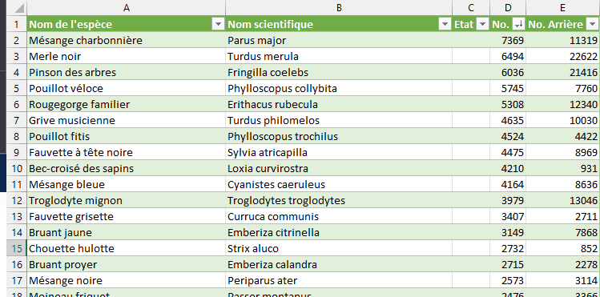

# Projet

- Vinh Faucher
- Florian Latapie

## Description du projet

### Contexte

set de données https://xeno-canto.org/explore/api

recherche du dataset ayant le plus d'espèces différentes : parsing de la page https://xeno-canto.org/collection/species/all avec excel afin de trouver la meilleure espèce 

découpage d'enregistrements aléatoires en qualité et longueurs et découpage en enregistremenets de 3 sec 

3 classes d'oiseaux, une classe que l'on va reconnaitre et deux pour tester. 

2500 de celui qu'on veut repérer 
250 de chaque autre

### Objectifs

### Environnement de test

## Workflow

de l'entrainement à l'IA embarquée et à la communication
diagramme illustrant ce workflow

## Modèle CNN

description du modèle CNN obtenu après l'entrainement (inspiré des labs microai_edu)

## Architecture de traitement des données du capteur

### Définition de DMA et ADC

## Résultats

présentation des résultats obtenus, et de la configuration expérimentale pour tester la généralisation de l'entrainement aux données réelles (pas celles du dataset)

## Analyse des résultats

### Performance

accuracy sur train, test et sur données réelles après quantization

### Taille mémoire

### Latence

### Consommation énergétique et durée de vie de la batterie

donnez l'estimation de votre consommation énergétique et l'autonomie de la batterie

## Conclusion et évolutions possibles du projet